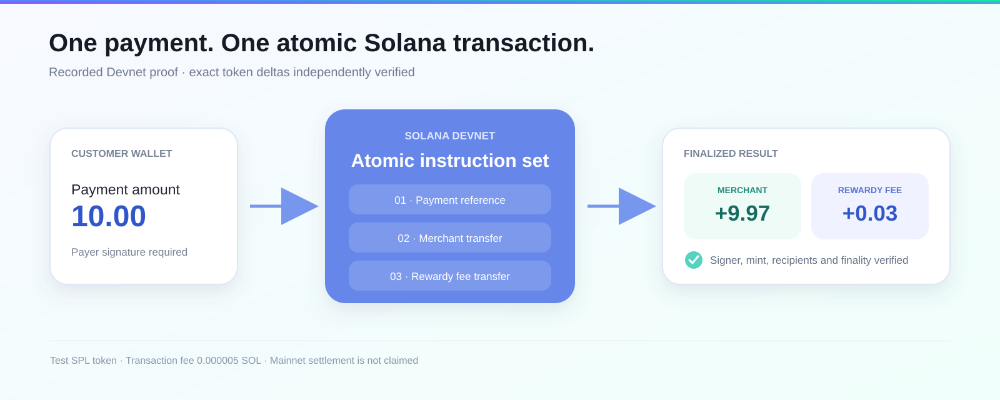
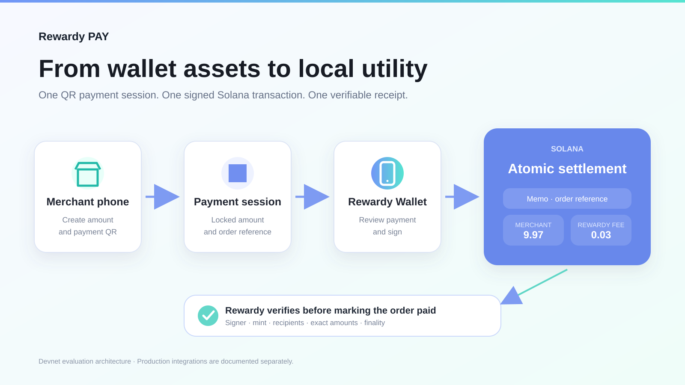
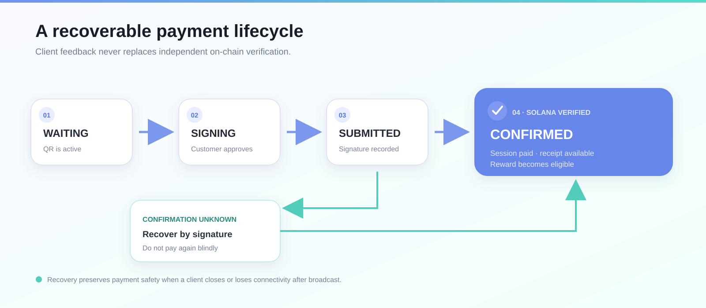

# Rewardy Pay

**Spend assets held in your wallet at local merchants.**

Rewardy Pay turns a merchant's smartphone into a crypto payment terminal. The
merchant creates a QR payment request, the customer approves it from a wallet,
and Solana settles the merchant amount and Rewardy fee in one verifiable
transaction.

[Why Solana](#why-solana) · [Architecture](docs/architecture.svg) · [Solana fit](docs/solana-fit.md) ·
[Payment lifecycle](docs/payment-lifecycle.svg) ·
[Demo guide](DEMO.md) ·
[Devnet transaction](https://explorer.solana.com/tx/3VgumguvQvi3Zf9kZ3QzqAuhmmyfqyisHQfWYSoaiYXnytpAqP1AGLnvhTw2VSrQYX2PaVGAgaMA2FAR17sjdHSV?cluster=devnet)

## Verified payment proof

| Input | Merchant receives | Rewardy fee | Result |
| ---: | ---: | ---: | :--- |
| 10.00 test SPL | 9.97 | 0.03 | Finalized on Solana Devnet |



The included proof script independently retrieves the public transaction and
checks the payer signature, mint, recipients, exact token deltas and finality.
No private key is needed.

```bash
npm ci
npm run proof:verify
```

Expected result:

```text
PASS Rewardy Pay Devnet proof verified
merchant: +9.97
rewardy fee: +0.03
payer: -10
```

## Why Solana

Solana is the settlement and verification layer that turns assets held in
Rewardy Wallet into spendable value at local merchants.

- **Atomic settlement:** the merchant amount and Rewardy fee execute in one
  transaction.
- **Wallet-native checkout:** the customer reviews and signs the payment from
  their wallet without a card terminal.
- **Verifiable payment state:** Rewardy checks the signer, mint, recipients,
  exact amounts and finality before marking an order paid.
- **Payment-grade economics:** the recorded Devnet payment used `0.000005 SOL`
  in network fees, which supports small payments and on-chain rewards.

**Solana provides the settlement rail. Rewardy provides the wallet, merchant
acceptance, payment recovery and reward loop.**

## Solana payment architecture



## Payment lifecycle and recovery

Payment success is never inferred from a button click. The client submits a
signature, the verifier independently checks the transaction, and the session
becomes paid only after confirmation. An unknown confirmation remains recoverable
and must not trigger a blind second payment.



## Run a new Devnet payment

This command creates a six-decimal test mint, funds a payer token account, and
sends `9.97` to a generated merchant wallet and `0.03` to a generated Rewardy
fee wallet. Both transfers and an order-reference memo are included in one
transaction. The script then reads the finalized transaction back from Solana
and verifies its effects.

```bash
npm run demo:devnet
```

The script uses the public Devnet RPC by default. To use another endpoint,
export `SOLANA_DEVNET_RPC_URL` in the current shell before running it.

If the public faucet is rate limited, print the reusable throwaway Devnet payer
address, fund it using an official Devnet faucet, and rerun:

```bash
npm run demo:address
npm run demo:devnet
```

The generated Devnet key is saved only under the git-ignored `.local/`
directory. Never provide a production or mainnet secret.

## What is shipped

- Merchant payment requests and QR checkout
- Rewardy Wallet payment review and signing flow
- Direct native SOL and same-asset SPL token payments
- Atomic merchant settlement and Rewardy fee transfer
- Memo-based Rewardy payment reference
- Independent confirmation and reconciliation
- Payment receipt, history, split-payment and refund-evidence flows

## Code map

| Area | Evaluator entry point | What it proves |
| --- | --- | --- |
| Payment planning | `src/payment-plan.ts` | Exact fee arithmetic, reference validation and destination invariants |
| Lifecycle safety | `src/payment-lifecycle.ts` | Allowed transitions and recoverable unknown confirmations |
| On-chain proof | `src/payment-proof.ts` | Signer, mint, recipient, delta and finality validation |
| Recorded proof | `scripts/verify-existing-transaction.ts` | Read-only reproduction using a public transaction |
| Live payment | `scripts/execute-devnet-payment.ts` | Memo plus merchant/fee transfers in one Devnet transaction |
| Regression tests | `test/payment-proof.test.ts` | Exact arithmetic, proof rejection and lifecycle safety |

## What is not claimed as shipped

- Jupiter automatic conversion
- Mayan or Wormhole cross-chain routing
- TMO Point or JPYSC production conversion
- Mainnet production settlement
- Solana Pay SDK compatibility

This repository uses Solana payment rails through `@solana/web3.js` and
`@solana/spl-token`. It does not claim Solana Pay protocol integration unless
the protocol package and compatible payment URLs are added and tested.

See [implementation status](docs/implementation-status.md) for the exact
boundary between working code, product integration and roadmap items.

## Repository purpose

This is an evaluator-facing, executable view of Rewardy Pay's Solana settlement
path. The production Rewardy Wallet, merchant application and backend remain
separate services. This repository intentionally excludes user data, internal
endpoints, production credentials and unrelated legacy code.

## Submission

The final deployed demo, pitch deck, team payout wallets and substantiated pilot
metrics should be added to [SUBMISSION.md](SUBMISSION.md) before the repository
is submitted. Claims without reproducible evidence must remain marked as targets
or roadmap items.
