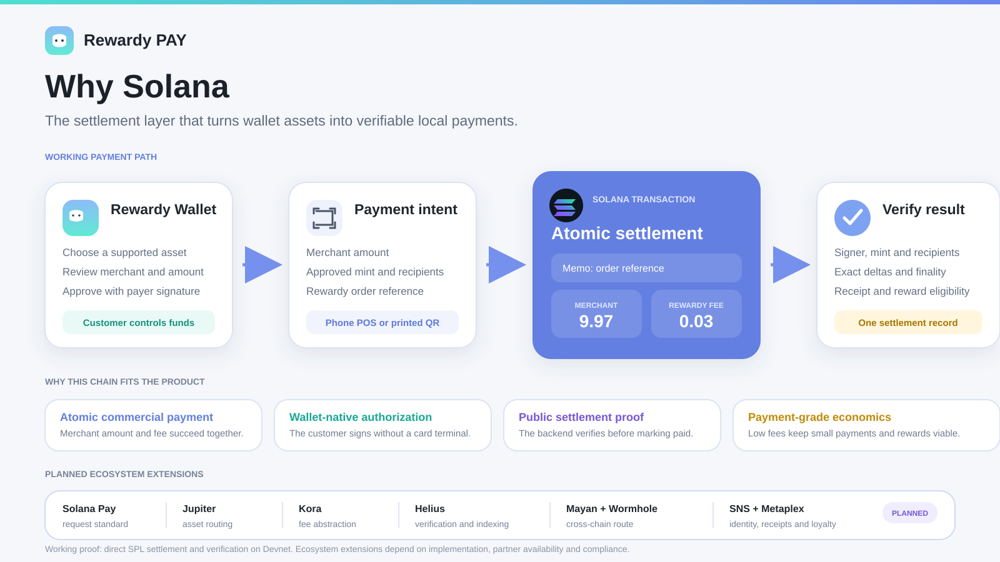

# Rewardy Wallet + Rewardy Pay

**Turn on-chain value into everyday payments.**

Rewardy Wallet is where users earn, hold and manage digital assets. Rewardy Pay
makes those assets usable at local merchants. A merchant creates a payment
request from a phone or printed QR, the customer approves it from a supported
wallet, and Solana becomes the shared settlement record for payment, receipt and
reward.

> Rewardy Wallet brings users. Rewardy Pay turns wallet activity into payment
> volume and merchant revenue.

[Why Solana presentation](#why-solana-presentation) |
[Architecture](docs/architecture.svg) |
[Verified Devnet proof](#reproducible-devnet-proof) |
[Demo guide](DEMO.md) |
[Implementation status](docs/implementation-status.md) |
[Current pitch deck](https://canva.link/e46swlj6z9mehti)

## Evaluator guide

| Judging area | Start here |
| --- | --- |
| Problem and market | [The problem](#the-problem) and [Traction and distribution](#traction-and-distribution) |
| Product and demo | [The solution](#the-solution), [Reproducible Devnet proof](#reproducible-devnet-proof) and [Run the code](#run-the-code) |
| Solana fit | [Why Solana presentation](#why-solana-presentation) and [Technical architecture](#technical-architecture) |
| Traction and distribution | [Seongsu pilot snapshot](#seongsu-pilot-snapshot) and [Go-to-market sequence](#go-to-market-sequence) |
| Team and pitch | [Execution edge and next milestones](#execution-edge-and-next-milestones) and the [current pitch deck](https://canva.link/e46swlj6z9mehti) |

## Product in one view

| Rewardy Wallet | Rewardy Pay | Merchant and rewards |
| --- | --- | --- |
| Earn, hold and manage assets | Spend from the same wallet | Receive a predictable settlement |
| Keep identity and payment history together | Create or scan a payment QR | Link payment, receipt and reward |
| Recover wallet access and payment state | Sign with Rewardy or another supported wallet | Use a phone instead of dedicated POS hardware |

The product is designed around one continuous relationship:

`Earn -> Hold -> Pay -> Settle -> Return`

External wallets can widen payment acceptance. Rewardy Wallet keeps the
customer relationship before and after checkout.

## The problem

Digital assets can be stored globally, but they are still difficult to spend at
ordinary physical merchants.

- Local QR systems often require a supported domestic app or local eligibility.
- Travel payment apps may require users to pre-fund a separate balance.
- Crypto gateways can add another checkout layer without preserving wallet
  history or rewards.
- Small merchants may have a smartphone but no dedicated crypto POS or
  settlement integration.
- Payment, settlement, recovery and loyalty frequently live in separate
  products.

The missing bridge is not another asset screen. It is a checkout that connects
wallet-held value to a merchant's preferred settlement and keeps the resulting
payment relationship in the wallet.

## The solution

Rewardy Pay turns the merchant's phone into a payment terminal:

1. The merchant enters an amount and creates a payment session.
2. A QR opens the order in Rewardy Wallet or another supported wallet.
3. The customer reviews the merchant, asset, amount and fee, then signs.
4. Solana settles the merchant amount and Rewardy fee atomically.
5. Rewardy independently verifies the transaction before issuing a paid receipt
   or making a reward eligible.

The customer chooses the asset. The merchant chooses the supported settlement.
Both parties share one verifiable payment record.


## Why Solana presentation

Solana is not decorative infrastructure in Rewardy Pay. It is the settlement
and verification layer that turns a wallet balance into merchant-accepted value.



### Why the chain is integral

| Product requirement | Role of Solana | Rewardy responsibility |
| --- | --- | --- |
| Merchant amount and platform fee must agree | Multiple instructions settle atomically in one transaction | Build the exact payment plan and reject invalid destinations |
| A wallet user must authorize spending | The payer signs the transaction directly | Show the merchant, asset, amount and fee before signing |
| A merchant needs an objective paid state | The ledger exposes signer, mint, recipients, deltas and finality | Verify every expected effect before marking the order paid |
| Small payments and frequent rewards must remain viable | Low transaction cost supports repeated payment and reward events | Operate checkout, recovery, reconciliation and the reward loop |
| Wallet choice should not require a closed payment network | Solana provides an open signing and settlement environment | Support Rewardy Wallet first and approved wallet routes over time |

**Solana provides the settlement rail. Rewardy owns the wallet, merchant
acceptance, payment state, recovery and retention loop.**

### Solana ecosystem roles

The deck presents a single payment session with optional ecosystem extensions.
Only the direct settlement path is part of the executable proof in this
repository.

| Capability | Intended role in Rewardy Pay | Status in this repository |
| --- | --- | --- |
| `@solana/web3.js` | Build, sign, submit and read Solana transactions | Working |
| `@solana/spl-token` | Create token transfers and inspect token balances | Working |
| Solana memo | Bind the on-chain transaction to a Rewardy order reference | Working in the live demo script |
| Solana Pay | Standard payment request and wallet handoff | Planned, not claimed as integrated |
| Jupiter | Convert a supported Solana asset into the settlement asset | Planned, routing and liquidity dependent |
| Kora | Abstract transaction fees for a smoother checkout | Planned, partner dependent |
| Helius | Production-grade indexing, monitoring and verification | Planned, provider dependent |
| Mayan + Wormhole | Route approved assets from another chain into Solana settlement | Planned, partner and compliance dependent |
| SNS | Human-readable merchant identity | Planned |
| Metaplex | On-chain receipt or loyalty primitives | Planned |
| TMO Point and JPYSC | Local utility routes in Korea and Japan | Product concepts, not production integrations |

This status split prevents the ecosystem vision from being mistaken for shipped
code.

## Technical architecture

### Components and trust boundaries

| Component | Responsibility | Trust rule |
| --- | --- | --- |
| Merchant phone or printed QR | Creates the order and exposes the payment session | The QR is a request, not proof of payment |
| Rewardy Wallet | Shows payment details and requests the payer signature | The private key remains under customer control |
| Payment planner | Validates mint, recipients, fee and exact integer amounts | Decimal display values never replace base-unit arithmetic |
| Solana transaction | Records the order memo and both transfers | Merchant and fee transfers succeed or fail together |
| Proof verifier | Reads the finalized transaction from the configured cluster | A client success screen is never trusted |
| Rewardy payment ledger | Advances the order state idempotently | Receipt and reward follow verified settlement only |

### Transaction construction

For the included SPL-token proof, one transaction contains:

```text
1. Memo: rewardy-pay-demo:<order-reference>
2. Transfer: payer token account -> merchant token account
3. Transfer: payer token account -> Rewardy fee token account
4. Payer signature
```

The payment plan uses integer base units. For a six-decimal token, the recorded
example is:

```text
gross amount       10.000000
merchant amount     9.970000
Rewardy fee          0.030000
invariant           10.000000 = 9.970000 + 0.030000
```

The verifier rejects a transaction unless all of these match the payment plan:

- cluster and finalized status;
- payer signature;
- approved token mint;
- merchant and Rewardy destinations;
- exact merchant and fee token deltas; and
- order reference when required.

## Recoverable payment lifecycle

Payment success is never inferred from a button click. The client submits a
signature, the verifier checks the public transaction, and only a valid proof
can move the payment session to `CONFIRMED`.


If connectivity is lost after broadcast, the state remains recoverable by
signature. Rewardy checks the submitted transaction again instead of asking the
customer to pay twice. State transitions are validated and confirmation is
idempotent.

## Reproducible Devnet proof

| Input | Merchant receives | Rewardy fee | Result |
| ---: | ---: | ---: | :--- |
| 10.00 test SPL | 9.97 | 0.03 | Finalized on Solana Devnet |


[Inspect the recorded transaction on Solana Explorer](https://explorer.solana.com/tx/3VgumguvQvi3Zf9kZ3QzqAuhmmyfqyisHQfWYSoaiYXnytpAqP1AGLnvhTw2VSrQYX2PaVGAgaMA2FAR17sjdHSV?cluster=devnet)

The read-only proof script retrieves the public transaction and checks the payer
signature, mint, recipients, exact token deltas and finality. It does not need a
private key.

```bash
npm ci
npm run proof:verify
```

Expected result:

```text
PASS Rewardy Pay Devnet proof verified
merchant: +9.97
rewardy fee: +0.03
payer: -10
```

The recorded network fee was `0.000005 SOL`. The token is a Devnet test asset,
not production USDC, and this repository does not claim mainnet settlement.

## Run the code

Requirements: Node.js 20 or later.

```bash
npm ci
npm run check
npm run proof:verify
```

`npm run check` performs strict TypeScript checking and runs the payment-plan,
proof and lifecycle test suite.

To create and verify a new throwaway Devnet payment:

```bash
npm run demo:devnet
```

The script creates a six-decimal test mint, funds a payer token account, builds
one transaction with the order memo and two transfers, submits it, waits for
finality and verifies the resulting deltas.

The public Devnet faucet may rate-limit new accounts. In that case:

```bash
npm run demo:address
npm run demo:devnet
```

The generated Devnet key is stored only in the git-ignored `.local/` directory.
Never provide a production or mainnet secret.

## What is shipped and what is proved here

The product deck covers the broader Rewardy Wallet and Rewardy Pay experience.
This public repository focuses on the independently reproducible Solana
settlement path.

| Scope | Capability | Evidence |
| --- | --- | --- |
| Public evaluator repository | Exact payment planning and fee arithmetic | `src/payment-plan.ts` and tests |
| Public evaluator repository | Direct SPL merchant and fee settlement | `scripts/execute-devnet-payment.ts` |
| Public evaluator repository | Existing transaction verification | `scripts/verify-existing-transaction.ts` |
| Public evaluator repository | Recoverable payment state machine | `src/payment-lifecycle.ts` and tests |
| Rewardy product surface | Customer wallet checkout and signing UI | Product demo and pitch deck |
| Rewardy product surface | Merchant QR, phone POS, order and refund flows | Product demo and pitch deck |
| Rewardy product surface | Payment history, receipt and reward experience | Product demo and pitch deck |

Product-surface claims require the submitted demo. The public code in this
repository is the source of truth for the executable Solana proof.

## Competitive position

The payment market contains strong products at individual layers. Rewardy's
position is to connect wallet access, merchant checkout, settlement and
retention in one product loop.

| Category | Core strength | Gap Rewardy targets |
| --- | --- | --- |
| Domestic QR systems | Dense local merchant acceptance | Access can depend on supported local apps and eligibility |
| Traveler payment apps | Visitor access to selected local QR networks | Users may manage a separate payment balance outside Rewardy Wallet |
| Exchange payment networks | Crypto checkout inside a large account network | Wallet choice and the customer relationship remain inside a closed network |
| Crypto payment processors | Merchant acceptance and settlement tooling | Checkout is separate from Rewardy's wallet and reward distribution |
| Rewardy Wallet + Rewardy Pay | Wallet plus phone POS | Direct wallet spending, verified settlement and rewards share one payment record |

The edge is not a new QR format alone. It is the combination of existing wallet
distribution, merchant acceptance on a phone, recoverable settlement and a
reward loop that brings the payer back.

## Business model

Rewardy is designed to earn when payment volume moves. These figures are
proposed pricing and illustrative economics, not historical revenue.

| Payment route | Proposed gross fee | What the fee covers |
| --- | ---: | --- |
| Direct Solana checkout | 0.30% | Payment orchestration, verification, receipt and reconciliation |
| Routed or converted checkout | 0.80% to 1.20% | Target total fee for approved swap, bridge or local settlement routes |

Illustrative month at `$1M GMV`:

```text
70% direct at 0.30%  = $2,100
30% routed at 1.00%  = $3,000
illustrative revenue = $5,100 per month, or 0.51% blended
```

At `$10M monthly GMV`, the same mix implies `$51,000` monthly gross revenue and
`$612,000` annualized gross revenue before partner, payout, liquidity,
compliance and operating costs. Merchant software, campaign budgets and balance
yield are excluded from this base case.

## Traction and distribution

### Seongsu pilot snapshot

The current deck reports the following operating data supplied by Rewardy:

| Pilot merchants | Payments per day | Daily payment volume |
| ---: | ---: | ---: |
| 5 | 30 to 50 | Approximately $25K |

Customers pay from a wallet using a printed QR or merchant phone POS. The pitch
uses the five Seongsu stores as reference locations before corridor expansion.
The reporting period and supporting evidence should be supplied to evaluators
alongside the deck.

### Go-to-market sequence

1. Prove repeat payments with dense reference merchants in Seongsu.
2. Use merchant phones and printable QR to reduce installation cost.
3. Expand in Malaysia through licensed local QR and payout partners.
4. Expand in Japan through approved stablecoin and local utility partners.
5. Measure activated merchants, successful payments, GMV, repeat payer rate and
   verified on-chain settlements.

Malaysia is a practical launch thesis because QR checkout is already familiar,
while visitors and some digital-asset users can still face a gap between their
wallet and locally accepted payment methods.

## Execution edge and next milestones

Rewardy Wallet, Rewardy Pay and the reward network share one identity, one
payment record and one reward balance. The team can iterate across the consumer
app, merchant experience and reconciliation path without handing the payment
relationship to separate products.

Next milestones:

- complete mainnet canaries, monitoring and incident controls;
- secure licensed payout and QR partners for each launch corridor;
- add approved asset routes only after liquidity, security and compliance
  review; and
- publish substantiated pilot evidence and measure repeat payment behavior.

The company is seeking capital and payment partners to move from controlled
pilots to production merchant corridors.

## Code map

| Area | Evaluator entry point | What it demonstrates |
| --- | --- | --- |
| Payment planning | [`src/payment-plan.ts`](src/payment-plan.ts) | Exact fee arithmetic, reference validation and destination invariants |
| Lifecycle safety | [`src/payment-lifecycle.ts`](src/payment-lifecycle.ts) | Allowed transitions and recoverable unknown confirmations |
| On-chain proof | [`src/payment-proof.ts`](src/payment-proof.ts) | Signer, mint, recipient, delta and finality validation |
| Recorded proof | [`scripts/verify-existing-transaction.ts`](scripts/verify-existing-transaction.ts) | Read-only reproduction using a public transaction |
| Live payment | [`scripts/execute-devnet-payment.ts`](scripts/execute-devnet-payment.ts) | Memo plus merchant and fee transfers in one Devnet transaction |
| Regression tests | [`test/payment-proof.test.ts`](test/payment-proof.test.ts) | Exact arithmetic, proof rejection and lifecycle safety |

## Repository boundary

This repository is an evaluator-facing, executable view of Rewardy Pay's Solana
settlement path. The production Rewardy Wallet, merchant application and backend
remain separate services. User data, internal endpoints, production credentials
and unrelated legacy code are intentionally excluded.

See [Solana fit](docs/solana-fit.md), [implementation status](docs/implementation-status.md),
[demo guide](DEMO.md), [security notes](SECURITY.md) and
[submission checklist](SUBMISSION.md) for additional detail.
